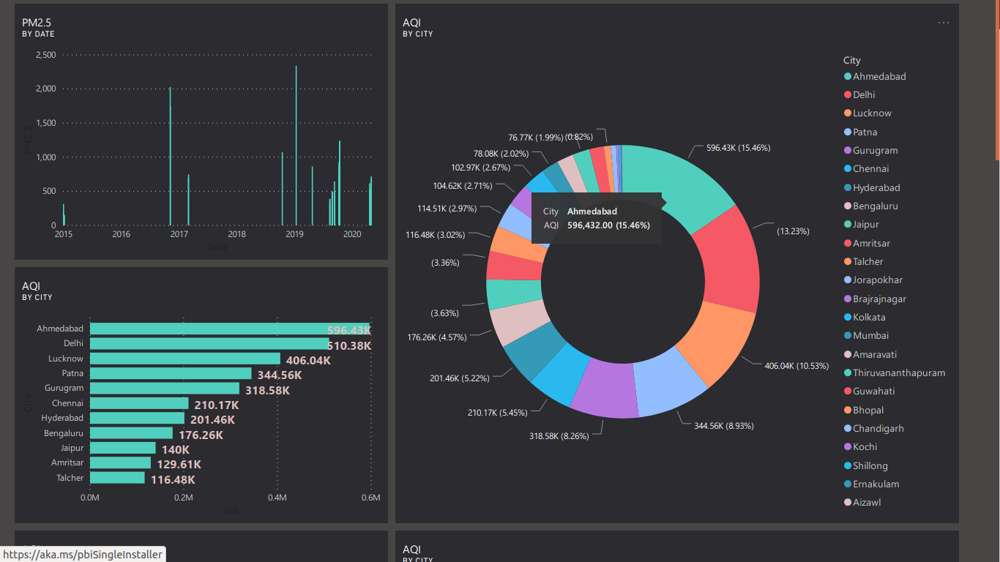
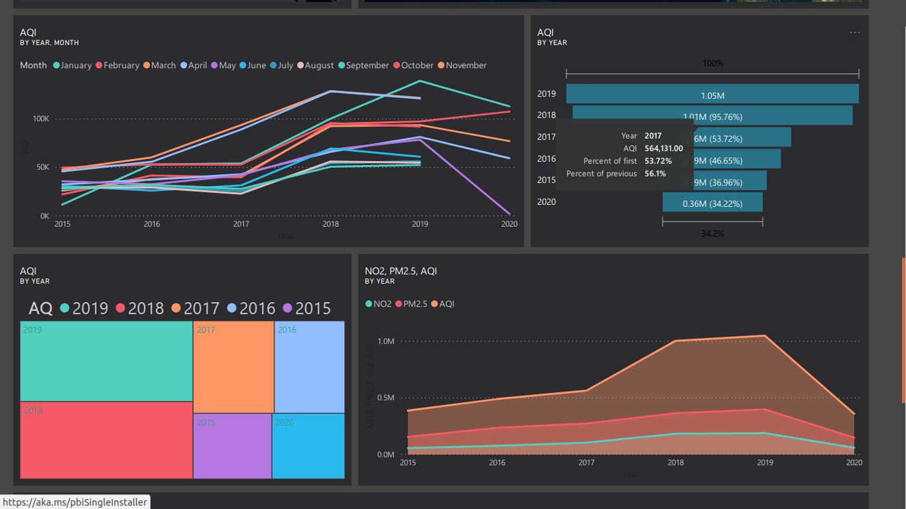
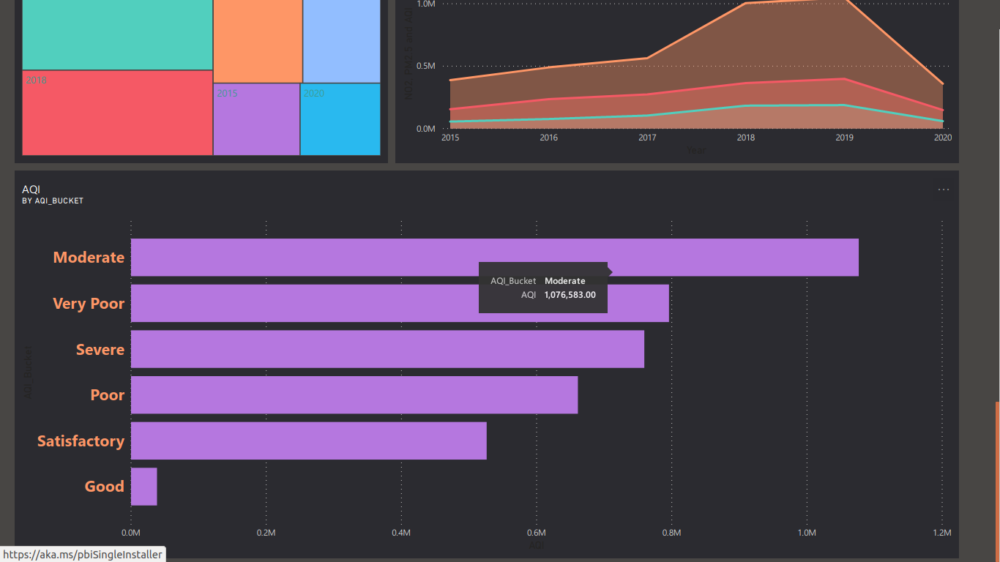

# Streamlit
Create a data explorer app.
# install streamlit
pip install streamlit 
----------------------------------------------------------------------------------------------------------------------------------------------
# Streamlit Data Science and ML Apps in Python
 Streamlit’s open-source app framework is the easiest way for data scientists and machine learning engineers to create beautiful, performant apps, All in pure Python.
 https://www.streamlit.io/
## Machine learning models used #
In this project we are using regression models such as:
* Multiple Linear Regression 
* Polynomial Regression 
* Decision Tree Regression 
* Random Forest Regression 
* Support Vector regression (SVR)

# DATA ANALYTICS ON AIR POLLUTION
i have created data analytics on corona virus using machine learning with Streamlit.
Building a Matplotlib to Plotly chart convert.
# Impact of Air Pollution on our Lives [Vehicular and Industrial Pollution to be taken as key point]
1.dataset 
download the dataset from kaggle
https://www.kaggle.com/rohanrao/air-quality-data-in-india
# Libraries Used
 numpy, pandas,sklearn,pkl,joblib,matplotlib,seaborn,streamlit.
# IDE used: 
spyder (Anaconda 3),sublime,spyder3.
# project
run the app.py
streamlit run app.py

#  DATA ANALYTICS ON AIR POLLUTION using Power BI

https://app.powerbi.com/groups/me/dashboards/435fb732-5165-47f7-816b-5fd95a73bbde?ctid=9a99984a-d810-43f1-b992-dd5f00d2f333
